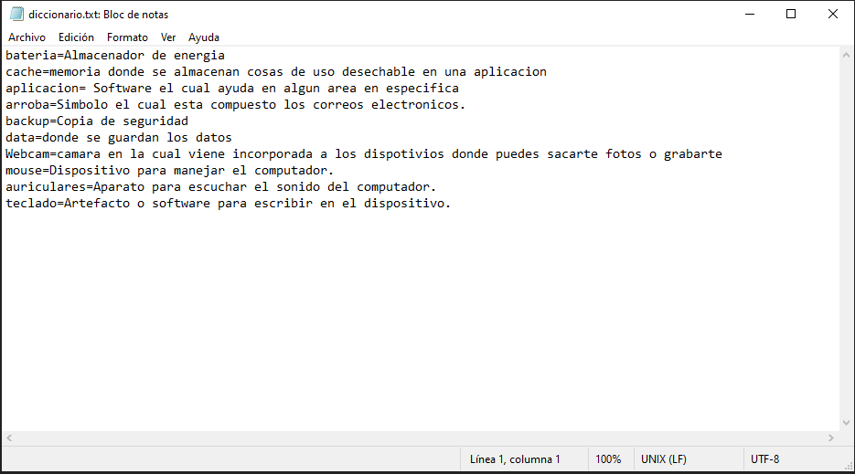
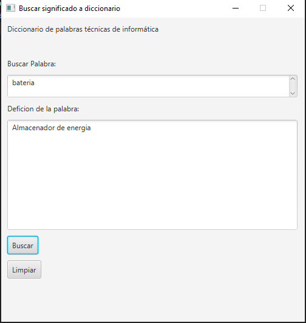
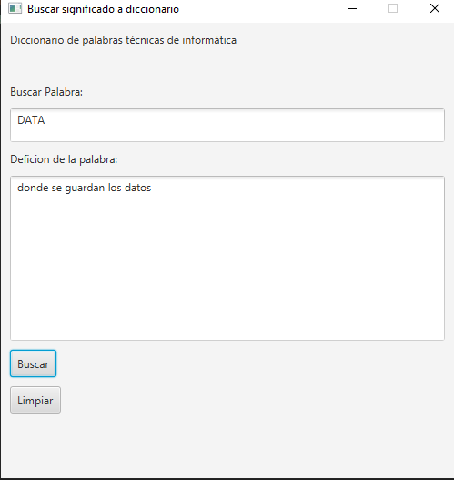
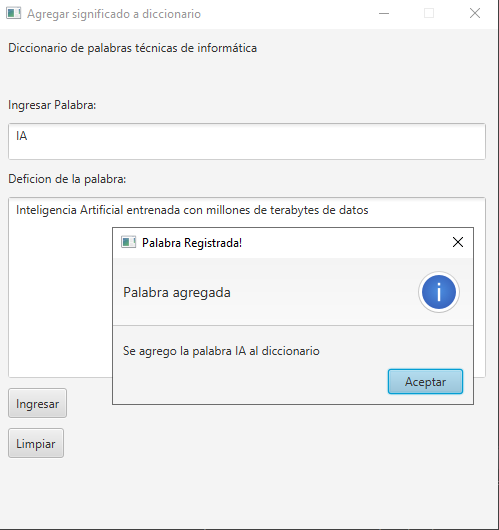
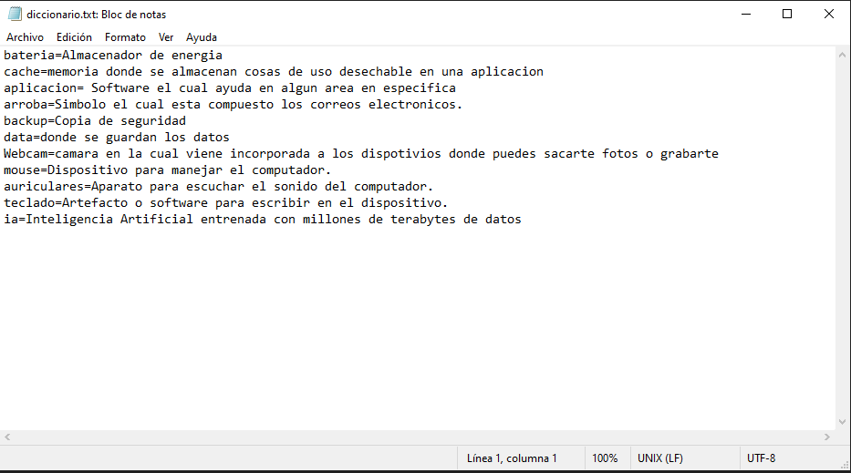
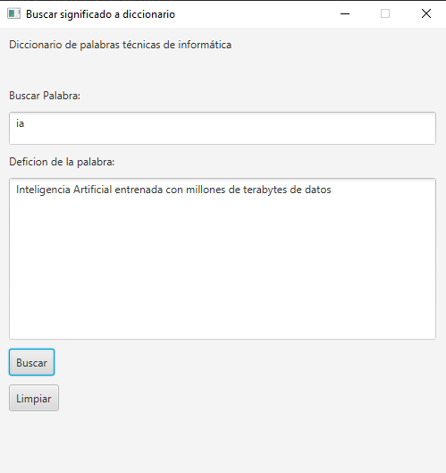

#GraphDictionaryManagerJavaFX

## Descripción 📑

Diccionario basado en Grafos que busca y manipula archivos .txt

## Vista previa del proyecto
Si quieres hechas un vistazo al proyecto, te recomiendo:

Este es el diccionario.txt donde ya hay algunas palabras incrustadas.

Si buscamos la palabra "bateria" :

Si buscamos la palabra "DATA" :

Si en la apicacion VentanaAgregar, agregamos una palabra, en este caso "IA":

el diccionario.txt despues de haber agregado la palabra:

y si lo buscamos 

## ¿Qué he aprendido en este proyecto? 🙇🏻 

Implementación de Estructuras de Datos con Grafos: He aprendido a utilizar nodos y grafos para estructurar y gestionar la información en un diccionario. Este enfoque me ha permitido comprender mejor cómo los grafos pueden representar relaciones y conexiones entre elementos de manera eficiente.

Desarrollo de Interfaces Gráficas en JavaFX: He adquirido experiencia en el diseño y la implementación de interfaces gráficas utilizando JavaFX. Esto incluye la creación de ventanas para buscar y agregar palabras, así como la integración de elementos gráficos para mejorar la experiencia del usuario.

Manejo de Archivos de Texto: He trabajado en la manipulación de archivos .txt para almacenar y modificar palabras. Esto ha implicado la lectura, escritura y actualización de datos en archivos de texto, lo que me ha enseñado cómo interactuar con el sistema de archivos en Java.

Diseño de Aplicaciones Interactivas: He aprendido a desarrollar aplicaciones que permiten la interacción dinámica del usuario, como buscar palabras en un diccionario y agregar nuevas entradas. Esto incluye la implementación de funciones que responden a las acciones del usuario en tiempo real.

Gestión de Estado y Sincronización de Datos: He adquirido conocimientos en la gestión del estado de la aplicación y la sincronización de datos entre la interfaz gráfica y el archivo de texto. Esto ha sido crucial para asegurar que los cambios realizados en la aplicación se reflejen correctamente en el archivo de datos.

Resolución de Problemas y Depuración: A lo largo del proyecto, he mejorado mis habilidades en la resolución de problemas y la depuración de código. He aprendido a identificar y corregir errores en el código y a asegurarme de que la aplicación funcione correctamente.

Documentación y Presentación del Proyecto: He mejorado en la documentación de mi trabajo, creando descripciones claras y visuales para el README. Esto incluye capturas de pantalla y explicaciones sobre el funcionamiento del proyecto para facilitar su comprensión por otros usuarios.

## Tecnologías 🛠
<!-- Iconos sacados de: https://github.com/hendrasob/badges/blob/master/README.md y https://github.com/alexandresanlim/Badges4-README.md-Profile -->

## Autor ✒️
**Kamikazejar**

* <a href="https://www.linkedin.com/in/rodrigocarmonah/" target="_blank">LinkedIn</a>
* <a href="https://rodrigocarmonaherrera.com/" target="_blank">Portafolio Web</a>
* [Email](mailto:rcarmonah@outlook.com)

  
## Instalación 
*APACHE NET BEANS Y IMPORTAR EL PROYECTO, Luego en el proyecto click izquierdo y "Run File" *
  
## Licencia 📄
MIT Public License v3.0
No puede usarse comencialmente.
